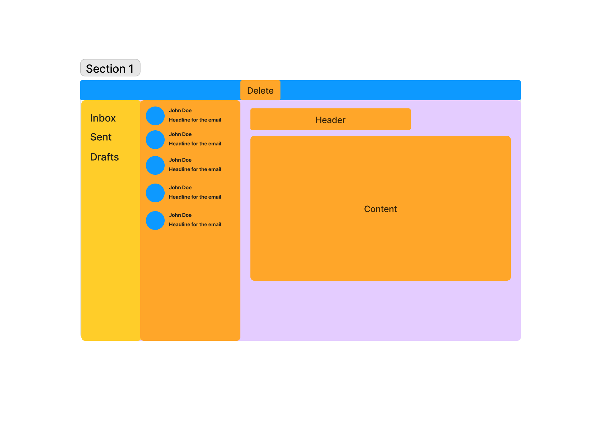

# Instructions

## Getting started

1. First run `npm run install` to install the dependencies for the project.

2. Then run `npm run dev` to start to the server in dev mode.

The server is running on port 5001

## Endpoints

### /emails

The endpoint is used to get all avaliable emails.
It can take in an optional query param called `status`, which can be used to filter the emails by their status (active, draft, sent).

### /emails/:id

The endpoint is used to get a single email by its id.
If you restart the dev server, the data will revert back it is initial values.

